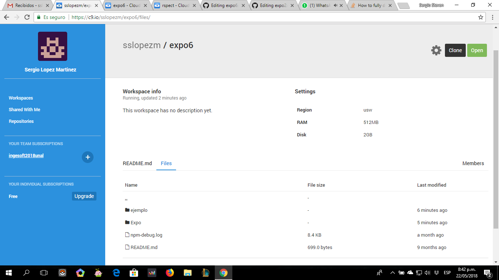
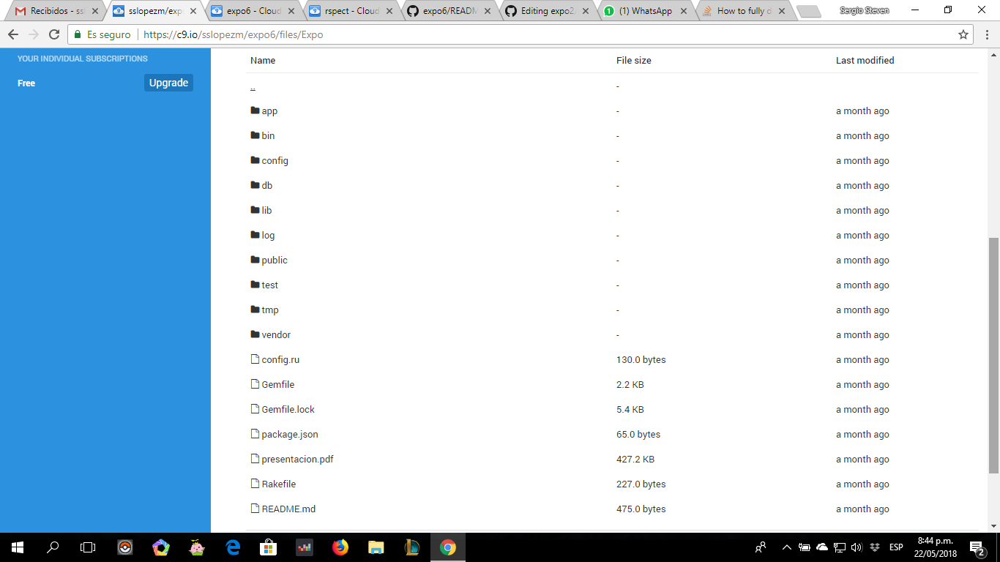

     ,-----.,--.                  ,--. ,---.   ,--.,------.  ,------.
    '  .--./|  | ,---. ,--.,--. ,-|  || o   \  |  ||  .-.  \ |  .---'
    |  |    |  || .-. ||  ||  |' .-. |`..'  |  |  ||  |  \  :|  `--, 
    '  '--'\|  |' '-' ''  ''  '\ `-' | .'  /   |  ||  '--'  /|  `---.
     `-----'`--' `---'  `----'  `---'  `--'    `--'`-------' `------'
    ----------------------------------------------------------------- 

Hi there! Welcome to Cloud9 IDE!

To get you started, create some files, play with the terminal,
or visit http://docs.c9.io for our documentation.
If you want, you can also go watch some training videos at
http://www.youtube.com/user/c9ide.

Happy coding!
The Cloud9 IDE team

# Expo6
## Aqui tenemos el proyecto creado hace dos meses aproximadamente durante la exposicion numero 6 con el tema de rail jobs

Carpeta ejercicio expo

